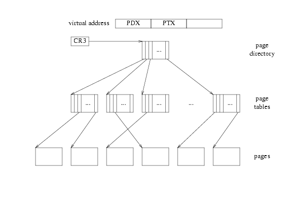

# JOS虚拟内存布局
```
    4 Gig -------->  +------------------------------+
                     |                              | RW/--
                     ~~~~~~~~~~~~~~~~~~~~~~~~~~~~~~~~
                     :              .               :
                     :              .               :
                     :              .               :
                     |~~~~~~~~~~~~~~~~~~~~~~~~~~~~~~| RW/--
                     |                              | RW/--
                     |   Remapped Physical Memory   | RW/--
                     |                              | RW/--
    KERNBASE, ---->  +------------------------------+ 0xf0000000      --+
    KSTACKTOP        |     CPU0's Kernel Stack      | RW/--  KSTKSIZE   |
                     | - - - - - - - - - - - - - - -|                   |
                     |      Invalid Memory (*)      | --/--  KSTKGAP    |
                     +------------------------------+                   |
                     |     CPU1's Kernel Stack      | RW/--  KSTKSIZE   |
                     | - - - - - - - - - - - - - - -|                 PTSIZE
                     |      Invalid Memory (*)      | --/--  KSTKGAP    |
                     +------------------------------+                   |
                     :              .               :                   |
                     :              .               :                   |
    MMIOLIM ------>  +------------------------------+ 0xefc00000      --+
                     |       Memory-mapped I/O      | RW/--  PTSIZE
 ULIM, MMIOBASE -->  +------------------------------+ 0xef800000
                     |  Cur. Page Table (User R-)   | R-/R-  PTSIZE
    UVPT      ---->  +------------------------------+ 0xef400000
                     |          RO PAGES            | R-/R-  PTSIZE
    UPAGES    ---->  +------------------------------+ 0xef000000
                     |           RO ENVS            | R-/R-  PTSIZE
 UTOP,UENVS ------>  +------------------------------+ 0xeec00000
 UXSTACKTOP -/       |     User Exception Stack     | RW/RW  PGSIZE
                     +------------------------------+ 0xeebff000
                     |       Empty Memory (*)       | --/--  PGSIZE
    USTACKTOP  --->  +------------------------------+ 0xeebfe000
                     |      Normal User Stack       | RW/RW  PGSIZE
                     +------------------------------+ 0xeebfd000
                     |                              |
                     |                              |
                     ~~~~~~~~~~~~~~~~~~~~~~~~~~~~~~~~
                     .                              .
                     .                              .
                     .                              .
                     |~~~~~~~~~~~~~~~~~~~~~~~~~~~~~~|
                     |     Program Data & Heap      |
    UTEXT -------->  +------------------------------+ 0x00800000
    PFTEMP ------->  |       Empty Memory (*)       |        PTSIZE
                     |                              |
    UTEMP -------->  +------------------------------+ 0x00400000      --+
                     |       Empty Memory (*)       |                   |
                     | - - - - - - - - - - - - - - -|                   |
                     |  User STAB Data (optional)   |                 PTSIZE
    USTABDATA ---->  +------------------------------+ 0x00200000        |
                     |       Empty Memory (*)       |                   |
    0 ------------>  +------------------------------+                 --+
```

1. 分段只在进出内核时,用于切换特权等级.
2. 使用分页功能组织进程的地址空间.
3. 使用分页功能,限制进程只能访问自己的地址空间.
4. 为什么将内核和当前进程映射到同一片虚拟地址空间,而不是分别映射4GB?
5. JOS内存分布和XV6内存分布有什么区别?
6. 为什么内核被映射到虚拟地址顶部?
7. 为什么要将所有物理内存映射到顶部?为什么重复映射?
8. 切换进程时,我们如何切换内存映射关系?

# The UVPT
或许缩写是: Userspace Virtual Page Table

目前我们已经比较熟悉x86的二级页表的映射方式了,即通过PDX和PTX来索引物理页.


但硬件MMU是非常傻的,它做的计算如下:
```
pd = lcr3(); pt = *(pd+4*PDX); page = *(pt+4*PTX);
```

因此如果我们将page directory中的一项V的PPN设置为page directory,那么再通过PTX就可以索引到page tables.


举例说明:
1. 在JOS中,V被设置为`0x3BD`.也就是上图指回page directory头部的那项的index.
2. 对应虚拟地址`(0x3BD<<22)|(0x3BD<<12)`的物理页就是page directory.
3. 虚拟地址前10位为`(0x3BD<<22)`,其后10位不为`(0x3BD<<12)`的虚拟地址,对应的物理地址就是各个page table.
4. 为了防止用户进程修改page table,因在PDE中设置用户只读.

## 疑问
1. 不太理解用户空间为什么要直接访问页表.


---