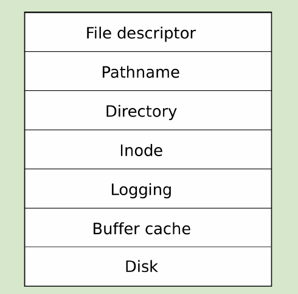

# 课前准备
1. 阅读文档第六章: 文件系统.log相关的内容可以跳过.
2. 阅读xv6源码中, `bio.c`, `fs.c`, `sysfile.c`以及`file.c`.

---

# 关键词
1. 持久化 persistence
2. 崩溃恢复 crash recovery
3. 事务处理 transaction
4. vfs模型 inode

---

---

1.  bio.c
buffer cache layer

2. fs.c
inode layer
directory layer

3. sysfile.c
用户进程操作文件系统 调用接口

4. file.c
file descriptor layer

---
