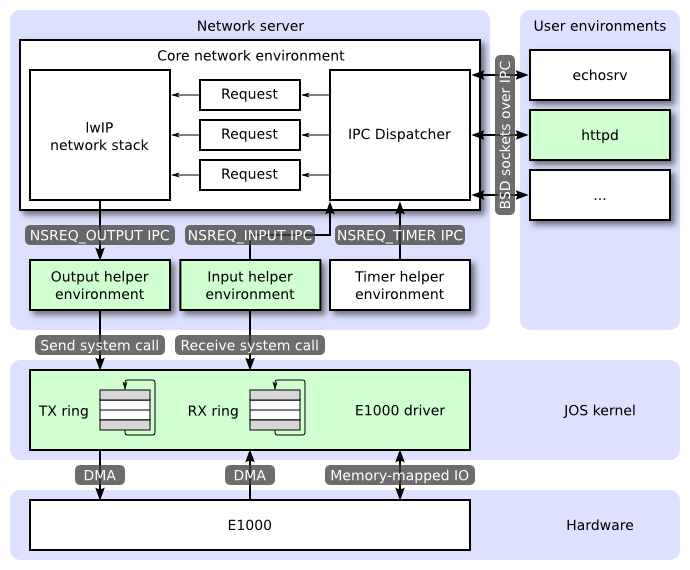

# Lab6: Network Driver 网络驱动

## Introduction 引言
现在JOS虽然已经有了文件系统,却不没有网络协议栈,任何现代操作系统都不会不支持网络通信.在本实验中,您将为网卡编写一个驱动程序.网卡将基于*Intel 82540EM*芯片,也称为*E1000*.

### Getting Started准备工作
和前几个实验类似,首先执行如下命令以初始化lab6的代码.
```
athena% cd ~/6.828/lab
athena% add git
athena% git commit -am 'my solution to lab5'
nothing to commit (working directory clean)
athena% git pull
Already up-to-date.
athena% git checkout -b lab6 origin/lab6
Branch lab6 set up to track remote branch refs/remotes/origin/lab6.
Switched to a new branch "lab6"
athena% git merge lab5
Merge made by recursive.
 fs/fs.c |   42 +++++++++++++++++++
 1 files changed, 42 insertions(+), 0 deletions(-)
athena%
```

然而,网卡驱动还不足以将JOS连接到互联网.在lab6代码中,已经为我们提供了网络协议栈和网络服务器的代码.与前面的实验一样,使用git获取lab6的代码,合并之前代码,接下来浏览`/net`目录中的文件和`/kern`中的新文件.

除了完成网卡驱动,我们还需要创建一个新的系统调用接口来访问网卡驱动.我们将实现缺失的网络服务器代码,以便在网络协议栈和网卡驱动程序间传输数据包.我们将通过完成一个网络服务器来把所有的代码联系起来.有了新的网络服务器,我们将能够从JOS文件系统中获取文件.

大多数内核设备驱动程序代码都必须从头开始编写.本实验提供的指导比以前的实验少得多:没有框架文件,没有已经写好的系统调用接口,许多设计需要我们自己决策.因此,我们最好在开始单个练习前,先完整阅读整个实验.

---
## QEMU's virtual network  QEMU虚拟网络
我们将使用QEMU的用户模式网络协议栈,因为它在普通用户权限就可以运行.更多用户网络的内容请参考QEMU[文档](https://qemu.weilnetz.de/doc/qemu-doc.html#Using-the-user-mode-network-stack).我们已经更新了makefile以启用QEMU的用户模式网络协议栈和虚拟E1000网卡.

```
     guest (10.0.2.15)  <------>  Firewall/DHCP server <-----> Internet
                           |          (10.0.2.2)
                           |
                           ---->  DNS server (10.0.2.3)
                           |
                           ---->  SMB server (10.0.2.4)
```
默认情况下,QEMU提供一个运行在IP`10.0.2.2`上的虚拟路由器,并将为JOS分配IP地址`10.0.2.15`.为了简单起见,我们在`net/ns.h`将这些默认值硬编码到网络服务器中.

虽然QEMU虚拟网络允许JOS任意连接到互联网,但是JOS的IP地址`10.0.2.15`在QEMU虚拟网络之外没有任何意义(也就是说,QEMU充当了一个NAT),所以我们从外部不能直接连接到JOS内部运行的进程,即使是运行QEMU的主机.为了解决这个问题,我们将QEMU配置为在主机上的某个端口上运行一个服务进程,该服务进程负责连接到JOS中的某个端口,并在真实主机和虚拟网络之间传输数据,即开启端口转发功能.

### Packet Inspection 查看通信报文
makefile还配置了QEMU的网络协议栈,将所有通信数据包记录到lab目录中的qemu.pcap.

要获取捕获数据包的十六进制/ASCII转储,请使用如下tcpdump:
```
tcpdump -XXnr qemu.pcap
```

另外,我们也可以使用[Wireshark](http://www.wireshark.org/)图形界面来查看pcap文件.wireshark支持数百种网络协议,我个人非常喜欢使用.

### Debugging the E1000 调试E1000
我们很幸运能够使用仿真硬件.由于E1000运行在软件中,模拟E1000可以以用户可读的格式向我们报告其内部状态和遇到的任何问题.通常,对于用裸机编写的驱动程序开发人员来说是不可能获取这些信息的.

E1000可以产生很多调试输出,所以我们必须启用特定的日志channel.一些有用的channel如下:
```

| Flag      | Meaning                                            |
|-----------|----------------------------------------------------|
| tx        | Log packet transmit operations                     |
| txerr     | Log transmit ring errors                           |
| rx        | Log changes to RCTL                                |
| rxfilter  | Log filtering of incoming packets                  |
| rxerr     | Log receive ring errors                            |
| unknown   | Log reads and writes of unknown registers          |
| eeprom    | Log reads from the EEPROM                          |
| interrupt | Log interrupts and changes to interrupt registers. |

```

例如,要启用"tx"和"txerr"日志记录,请使用`make E1000_DEBUG=tx,txerr ...`

注意,`E1000_DEBUG`仅针对6.828版本的QEMU有效.

我们可以进一步使用软件模拟硬件进行调试.如果开发过程中陷入困境,不明白E1000为什么没有按照预期的方式响应,可以看看QEMU在`hw/e1000.c`中的E1000实现.

---
## The Network Server 网络服务进程
从零开始写网络堆栈是一项艰苦的工作.相反,我们将使用lwIP,这是一个开源的轻量级TCP/IP协议套件,其中包括一个网络协议栈.你可以在[这里](https://savannah.nongnu.org/projects/lwip/)找到更多关于lwIP的信息.在这个任务中,就我们而言,lwIP是一个黑盒,它实现了一个BSD套接字接口,并且有一个包输入端口和包输出端口.

网络服务进程实际上是四个进程的组合:
1. 核心网络服务进程(包括套接字调用调度程序和lwIP)
2. 输入进程
3. 输出进程
4. 定时器进程

下图显示了不同的进程及其关系.该图显示了包括设备驱动程序在内的整个系统,这将在后面介绍.在本实验中,我们将实现绿色显示的部分.



### The Core Network Server Environment 核心网络服务进程
核心网络服务进程由套接字调用调度程序和lwIP两部分组成.套接字调用调度程序的工作方式与文件服务进程完全一样.用户进程使用库函数(在`lib/nsipc.c`中)向核心网络进程发送ipc消息.如果查看`lib/nsipc.c`,我们会发现找到核心网络服务进程的方式与找到文件服务进程的方式相同: `i386_init`用`NS_TYPE_NS`创建了NS进程,所以我们扫描`envs`,寻找这种特殊的进程类型.对于每个用户进程IPC,网络服务进程中的调度程序代表用户调用lwIP提供的BSD套接字接口函数.

普通用户进程不会直接使用`nsipc_*`调用.相反,它们使用`lib/sockets.c`中的函数,后者提供了一个基于文件描述符的套接字应用编程接口.因此,用户进程通过文件描述符引用套接字,就像他们如何引用磁盘上的文件一样.有些操作(connect,accept等)是套接字特有的,但是read,write和close都要经过`lib/fd.c`中的普通文件描述符设备调度代码.就像文件服务进程如何维护所有打开文件的内部唯一标识一样,lwIP也为所有打开的套接字生成唯一标识.在文件服务进程和网络服务进程中,我们使用存储在`struct Fd`中的信息将每个进程的文件描述符映射到这些唯一的标识空间.

尽管文件服务进程和网络服务进程的IPC调度程序看起来是一样的,但还是有一个关键的区别.像accept和recv这样的BSD套接字调用可以无限期地阻塞.如果调度程序让lwIP执行其中一个阻塞调用,调度程序也会阻塞,整个系统一次只能有一个未完成的网络调用.当然这是不可接受的,网络服务进程使用用户级线程来避免阻塞整个服务进程.对于每个传入的IPC消息,调度程序创建一个线程,并在新创建的线程中处理请求.如果线程阻塞,那么只有该线程进入睡眠状态,而其他线程继续运行.

除了核心网络服务进程之外,还有三个辅助进程.除了接受来自用户应用程序的消息,核心网络服务进程的调度程序也接受来自输入和定时器进程的消息.

### The Output Environment 输出辅助进程
当被用户进程套接字调用时,lwIP将生成数据包供网卡传输.LwIP将使用`NSREQ_OUTPUT`IPC发送数据包到输出辅助进程中,数据包附加在IPC消息的页面参数中.输出进程负责接受这些消息,并通过我们即将创建的系统调用接口将数据包转发到设备驱动程序.

### The Input Environment 输入辅助进程
网卡收到的数据包需要注入lwIP中.对于设备驱动程序接收到的每个数据包,输入进程将数据包从内核空间中取出(使用我们即将实现的内核系统调用),并使用`NSREQ_INPUT`IPC消息将数据包发送到核心服务进程.

包输入功能与核心网络进程是分开的,因为JOS使得很难同时接受IPC消息和轮询或等待来自设备驱动程序的包.JOS中没有`select`系统调用,它允许进程监控多个输入源,以识别哪个输入准备好被处理.

如果浏览`net/input.c`和`net/output.c`,会发现两者都有需要实现的部分.这主要是因为实现取决于我们的系统调用接口.实现驱动程序和系统调用接口后,我们将实现这两个辅助进程.

### The Timer Environment 定时器进程
计时器进程定期向核心网络服务进程发送`NSREQ_TIMER`类型的消息,通知它计时器已过期.lwIP使用来自该线程的计时器消息来实现各种网络超时功能.

---
# Part A: Initialization and transmitting packets A: 初始化和传输数据包
JOS内核没有时间的概念,所以我们需要添加它.目前,硬件每10ms生成一个时钟中断.在每个时钟中断,我们可以自增一个变量来表示时间度过了10ms.逻辑在`kern/time.c`中已经实现,但尚未完全集成到JOS内核中.

### Exercise1
为`kern/trap.c`中的每个时钟中断添加一个`time_tick`调用.实现`sys_time_msec`,并将其添加到`kern/syscall.c`中的`syscall`,以便用户空间可以获取时间.

使用`make INIT_CFLAGS=-DTEST_NO_NS run-testtime`,来测试这部分实现.我们应该会看到进程每隔1秒钟从5开始倒数."-DTEST_NO_NS"禁止启动网络服务进程,因为此时进程尚未显示,会导致死机.

## The Network Interface Card 网卡
编写驱动程序需要深入了解硬件及硬件呈现给软件的接口.lab文档将提供如何与E1000交行的上层描述,但在编写驱动程序时,我们还是需要仔细阅读英特尔手册.

### Exercise2
浏览[Intel Software Developer's Manual](https://pdos.csail.mit.edu/6.828/2017/readings/hardware/8254x_GBe_SDM.pdf).手册涵盖几个密切相关的以太网控制器.QEMU模拟`82540EM`.

我们现在应该浏览第二章,了解一下这个设备.要编写驱动程序,我们需要熟悉第3章和第14章,以及4.1(不包括4.1.*).我们还需要参考第13章.其他章节主要涉及E1000的组件,我们的驱动程序不必与之交互.现在不要担心细节;感受一下文档的结构,便于以后查找相关内容.

阅读手册时,请记住E1000是一款具有许多高级功能的复杂设备.正常工作的E1000驱动程序只需要网卡提供的一小部分功能和接口.仔细考虑与网卡交互的最简单方法.强烈建议在利用高级功能之前,首先让基本驱动程序正常工作.

### PCI Interface PCI接口
E1000是一个PCI设备,这意味着它需要插入主板上的PCI总线.PCI总线有地址,数据和中断总线,允许CPU与PCI设备通信,并允许PCI设备读写内存.PCI设备在使用前需要被发现和初始化.发现是在PCI总线上寻找连接设备的过程.初始化是分配I/O和内存空间的过程,也是为设备协商IRQ线的过程.

JOS已经为我们在`kern/pci.c`中提供了PCI代码.为了在启动引导过程中执行PCI初始化,PCI代码在PCI总线上寻找设备.找到设备后,它会读取其供应商ID和设备ID,并将这两个值用作搜索`pci_attach_vendor`数组的关键字.该数组由如下`struct pci_driver`条目组成:
```
struct pci_driver {
    uint32_t key1, key2;
    int (*attachfn) (struct pci_func *pcif);
};
```

如果发现的设备供应商ID和设备ID与数组中的条目匹配,PCI代码将调用该条目的`attchfn`来执行设备初始化.(设备也可以通过类来识别,这是`kern/pci.c`中的另一个驱动程序表的作用.)

`attachfn`函数将传入的`struct pci_func`初始化.PCI接口可以支持多个初始化函数,但E1000只支持一个.以下是JOS中的`struct pci_func`:
```
struct pci_func {
    struct pci_bus *bus;

    uint32_t dev;
    uint32_t func;

    uint32_t dev_id;
    uint32_t dev_class;

    uint32_t reg_base[6];
    uint32_t reg_size[6];
    uint8_t irq_line;
};
```

上述结构反映了*开发手册*第4.1节表4-1中的一些条目.`struct pci_func`的最后三个条目对我们特别有意义,因为它们记录了设备协商后的内存,IO和中断资源.`reg_base`和`reg_size`数组包含多达六个基址寄存器(Base Address Registers,BARs)的信息.`reg_base`存储内存映射IO区域的基本内存地址(或IO端口资源的基本IO端口),`reg_size`包含`reg_base`中相应基值的字节大小或IO端口数量,`irq_line`包含分配给设备的irq中断线.E1000 BARs的具体含义见表4-2的后半部分.

当设备的`attachfn`函数被调用时,该设备已找到,但尚未启用.这意味着PCI代码尚未确定分配给设备的资源,例如地址空间和IRQ线,因此,`struct pci_func`的最后三个元素尚未填充.`attachfn`函数应该调用`pci_func_enable`,这将启用设备,协商这些资源,并填充`struct pci_func`.

### Exercise3
实现`attachfn()`函数来初始化E1000.在`kern/pci.c`中的`pci_attach_vendor`数组中添加一项,以便在找到匹配的pci设备时触发我们的函数(请务必将它放在标记表格结尾的{0,0,0}项之前).我们可以在第5.2节中找到QEMU模拟的82540EM的供应商ID和设备ID.JOS在引导时,会扫描PCI总线,我们还应该看到这些信息被打印出来.

现在,只需通过`pci_func_enable`启用E1000设备.我们将在整个实验中添加更多初始化操作.

JOS已经为我们提供了`kern/e1000.c`和`kern/e1000.h`文件,因此我们修改编译系统.它们目前是空白的;我们需要在这个练习中填写它们.我们可能还需要在内核的其他地方包含`e1000.h`文件。

当启动内核时,我们应该会看到它打印E1000网卡的PCI功能已启用.现在执行`make grade`来测试代码,应该可以通过`pci attach`测试.

### Memory-mapped I/O
软件通过内存映射输入输出(memory-mapped IO,MMIO)与E1000通信.在JOS中我们已经见过两次了: CGA console和LAPIC都是通过直接操作*内存*来控制和查询设备.但是这些读写不是操作物理内存;而是直接操作这些设备.

`pci_func_enable`与E1000协商MMIO区域,并将其基数和大小存储在BAR0(即,`reg_base[0]`和`reg_size[0]`)中.这是分配给设备的一个物理内存地址区间,这意味着我们必须通过虚拟地址来访问它.由于MMIO地址被分配在非常高的物理地址(通常超过3GB),由于JOS的256兆内存限制,我们不能使用KADDR来访问它.因此必须创建一个新的内存映射.我们将使用MMIOBASE上方的区域(在lab4中的`mmio_map_region`将确保我们不会覆盖LAPIC使用的映射).因为PCI设备初始化发生在JOS创建用户进程之前,所以我们可以在`kern_pgdir`中创建映射,并且它总是可用的.

### Exercise4
在我们的`attachfn()`函数中,通过调用`mmio_map_region`(在lab4中编写了该函数来支持LAPIC的内存映射),为E1000的BAR0创建一个虚拟内存映射.

我们需要在变量中记录该映射的位置,以便以后可以访问刚刚映射的寄存器.看看`kern/lapic.c`中的lapic变量,以了解实现这一点的一种方法.如果我们使用了指向设备寄存器映射的指针,请确保声明它为`volatile`;否则,编译器可能缓存值并重排序对此内存的访问.

要测试映射是否正确,请尝试打印出设备状态寄存器(第13.4.2节).这是一个4字节寄存器,从寄存器空间的第8个字节开始.我们应该会得到`0x80080783`,这表示全双工链路速率为1000MB/s.

提示: 我们需要很多常量,比如寄存器的位置和位掩码的值.试图从开发手册中复制这些值容易出错,而错误会导致痛苦的调试过程.我们建议改用QEMU的[e1000_hw.h](https://pdos.csail.mit.edu/6.828/2017/labs/lab6/e1000_hw.h)作为指导.不建议逐字逐句地复制它,因为它定义的东西远远超过了我们的实际需要,可能没有按照我们需要的方式定义,但这是一个很好的参考.

### DMA
我们可以想象通过读写E1000的寄存器来发送和接收数据包,但是这将会很慢,并且需要E1000在内部缓冲数据包数据.相反,E1000使用直接存储器访问(Direct Memory Access,DMA)来直接从存储器读取和写入数据包,而不需要CPU参与.驱动程序负责为发送和接收队列分配内存,设置DMA描述符,并用这些队列的位置配置E1000,但此后的一切都是异步的.要发送数据包,驱动程序将其复制到发送队列中的下一个DMA描述符中,并通知E1000有数据包可用;当有时间发送数据包时,E1000将从描述符中复制数据.同样,当E1000接收到数据包时,它会将其复制到接收队列中的下一个DMA描述符中,驱动程序可以在下一次读取该描述符.

在上层看来,接收和发送队列非常相似.两者都由一系列描述符组成.虽然这些描述符的确切结构各不相同,但每个描述符都包含一些标志和包含数据包的缓冲区的物理地址(或者是要发送的数据包,或者是操作系统分配的用于写入接收数据包的缓冲区).

队列被实现为循环数组,这意味着当网卡或驱动程序到达数组的末尾时,它会绕回开始处.两者都有一个头指针和一个尾指针,队列的内容是这两个指针之间的描述符.硬件总是从头部消耗描述符并移动头部指针,而驱动程序总是向尾部添加描述符并移动尾部指针.发送队列中的描述符代表等待发送的数据包(因此,在稳定状态下,传输队列为空).对于接收队列,队列中的描述符是可以接收数据包的空闲描述符(因此,在稳定状态下,接收队列由所有可用的接收描述符组成).正确更新尾部寄存器而不混淆是很棘手的;小心点.

指向这些数组的指针以及描述符中数据包缓冲区的地址都必须是物理地址,因为硬件与物理内存交互时不会经过内存管理单元(MMU).

---
## Transmitting Packets
### C Structures
---
## Transmitting Packets: Network Server
---
# Part B: Receiving packets and the web server
## Receiving Packets
## Receiving Packets: Network Server
## The Web Server
