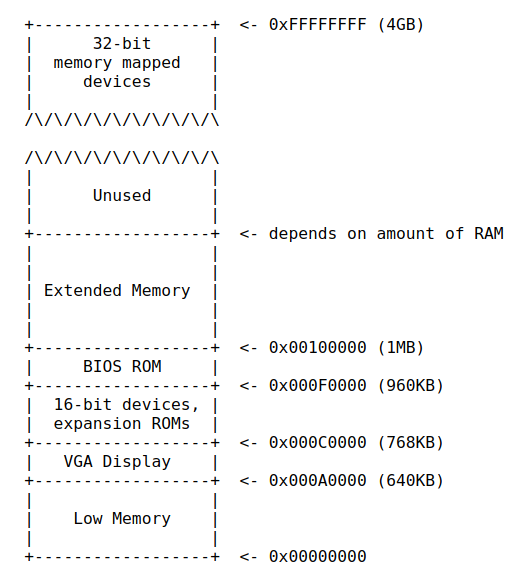

# 物理内存布局

本小节我们来考察Pc物理内存布局.

## 早期Intel 8088处理器

在早期的处理器,比如经典的Intel 8088处理器,只有16位的地址总线.可以寻址的空间就是2^16字节,换算下就是1MB.

整个可用的物理内存空间就是0x00000000 ~ 0x000FFFFF,其中前640KB地址空间被称为`Low Memory`,是这些早期Pc可以使用的.而事实上,当时的Pc实际使用的内存往往只有16KB~64KB.

剩下从0x000A0000~0x000FFFFF的384KB内存空间,则被保留作为特殊用途.比如作为VGA显示,硬件内存和一些固件.

